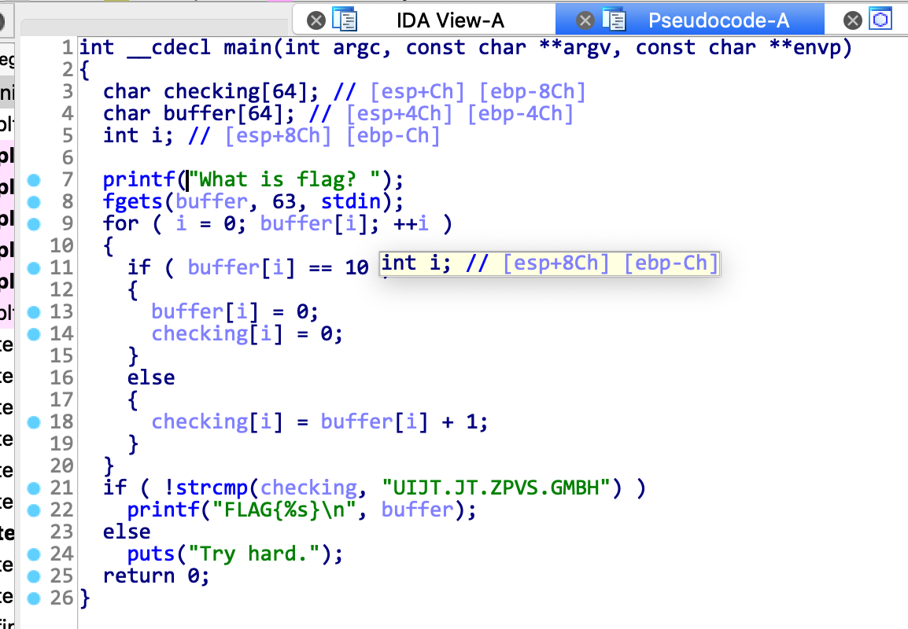

# hackme.inndy.tw --- reversing --- simple

## 1. Challenge

```
A little bit harder
```

## 2. Solution

Drop the binary to IDA, and you will see 



So we can write a script to recover the flag.

```python
c = 'UIJT.JT.ZPVS.GMBH'
p = ''
for i in c:
    p += chr(ord(i) - 1)
print('FLAG{%s}' % p)
```

